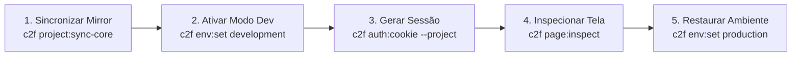

# Inspeção e Validação Visual Automatizada no Ambiente Local Conn2Flow

# ⚡ Gatilho Obrigatório
- **TRIGGER**: Validar renderização visual, estilos computados (`getComputedStyle`), animações CSS (`getAnimations`), erros de console JavaScript ou rotas autenticadas do Gestor no ambiente local de testes (Docker).
- **SKIP APENAS SE**: Tarefas puramente de backend CLI ou migrations sem renderização de tela.
- **CONSEQUÊNCIA DE IGNORAR**: Deixar itens pendentes como "aguarda homologação visual do operador", gastando rodadas extras de contexto e mascarando bugs visuais (ex: `@media (prefers-reduced-motion)` ou classes CSS ocultas).

---

## 🔄 Ciclo de Vida Canônico de 5 Etapas



### Protocolo Passo a Passo:

#### Passo 1: Sincronização do Mirror (Se o Core foi modificado)
```bash
./c2f project:sync-core <projectID>
```
*Garante que o espelho de teste local (`dev-environment/data/sites/localhost/<site>/`) possui as funções e bibliotecas mais recentes do Core.*

#### Passo 2: Ativação do Modo de Desenvolvimento
```bash
./c2f env:set development --project=<projectID>
```
*Habilita leitura direta de recursos em disco (`resources/`) e relaxamento seguro de cookies em conexões HTTP locais.*

#### Passo 3: Geração do Cookie Jar Server-Side
```bash
./c2f auth:cookie --project=<projectID>
```
*Gera `temp/agent-cookies.txt` com as credenciais de sessão autenticadas pelo runtime dentro do container Docker.*

#### Passo 4: Inspeção Visual e Coleta de Evidências (HTML Verbatim com Bypass de Sanitização)
```bash
./c2f page:inspect "http://localhost/<site>/<rota>" --selector="<seletor>" --computed="display,opacity,transform" --screenshot
```
*Executa o Chrome Headless via Playwright, injeta os cookies da sessão e devolve JSON com status HTTP, erros de console JS, estilos computados e screenshot PNG.*
> [!NOTE]
> Como a sessão do agente utiliza autenticação de administrador (`auth:cookie`), o sanitizador de HTML é **automaticamente bypassado** (`gestor_dashboard_toolbar_ativo() === true`). O agente recebe o HTML com comentários de arquitetura, seções (`data-id`, `data-title`) e marcadores de widgets (`<!-- widgets#... -->`) intactos.

#### Passo 5: Restauração do Ambiente (Tear Down Obrigatório)
```bash
./c2f env:set production --project=<projectID>
```
*Restaura o modo de produção no `.env` do projeto e encerra o ciclo de teste com segurança.*

---

## 🛠️ Guia de Resolução de Problemas (Troubleshooting)

1. **`DB_HOST=mysql` & Conectividade de Banco**:
   - Os comandos que acessam banco (`auth:cookie`, `db:test`) dependem do container Docker `conn2flow-app` / `mysql` ativo.
2. **`503 .env not found`**:
   - Se o projeto não localizar o arquivo `.env`, certifique-se de passar `--project=<projectID>` e verificar se `path_tests` está configurado corretamente em `dev-environment/data/environment.json`.
3. **Falsos Negativos por Core Desatualizado**:
   - Se uma nova função do core não for encontrada durante a execução da página no mirror, execute imediatamente o **Passo 1** (`./c2f project:sync-core <projectID>`).

---

## 🎨 Auditoria de CSS em Telas Inspecionadas

Após a inspeção visual (Passo 4), o agente pode complementar a validação com auditoria de CSS para identificar classes órfãs, CSS derivado desatualizado ou dívida técnica de classes Tailwind em PHP/JS:

```bash
./c2f css:audit --url=<rota-inspecionada>
```

Este comando audita a página composta real (layout + componentes renderizados) e mapeia:
- Classes CSS declaradas mas não utilizadas no HTML renderizado.
- Classes Tailwind geradas dinamicamente por PHP/JS (dívida técnica).
- Divergências entre `css_compiled` no banco e o CSS que deveria ser derivado do HTML atual.

---

## ⛔ Regras Invioláveis de Inspeção:
1. **EXCLUSIVO PARA AMBIENTE LOCAL DE TESTES**: NUNCA execute inspeção, auth ou scraping automatizado em URLs de produção.
2. **Registro no SDD**: As evidências de inspeção (JSON do `page:inspect` e screenshots) DEVEM ser registradas diretamente no `VALIDATION-CHECKLIST.md` do repositório em vez de marcar "pendente do operador".
3. **Tear Down Obrigatório**: SEMPRE finalize restaurando o ambiente com `c2f env:set production --project=<projectID>`.
