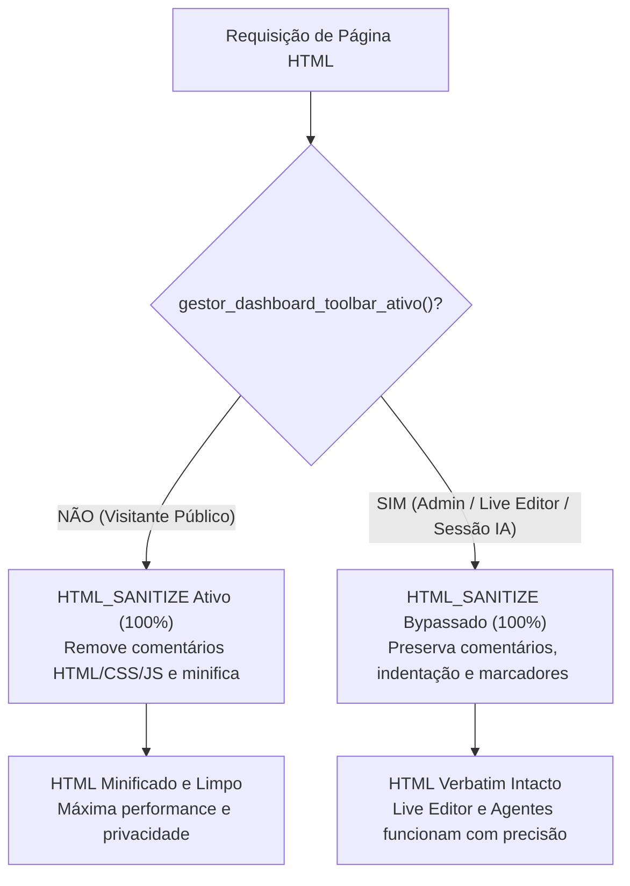

# Governança de Arquivos HTML, CSS e Markdown no Conn2Flow

# ⚡ Gatilho Obrigatório
- **TRIGGER**: Escrever, editar ou migrar marcações HTML, estilos CSS ou layouts do sistema.
- **SKIP APENAS SE**: Manipulação de lógica puramente de backend em PHP ou APIs sem renderização visual.
- **CONSEQUÊNCIA DE IGNORAR**: Criação de arquivos estáticos soltos que são ignorados pelo pipeline de sincronização, não chegam ao banco de dados e geram páginas 404 em produção.

---

> [!WARNING]
> **ATENÇÃO AGENTE: PROIBIDO CRIAR ARQUIVOS ESTÁTICOS SOLTOS**
> NUNCA crie arquivos `.html`, `.css` ou `.md` soltos na raiz do projeto, em diretórios públicos estáticos (ex: `public/`, `assets/`) ou na raiz de módulos PHP!

## 1. Obrigatoriedade do Sistema de Recursos (`c2f-resources-system`)

No Conn2Flow, **todo conteúdo visual ou instrução textual** (páginas, layouts, componentes, templates, variáveis e prompts de IA) DEVE residir no **Sistema de Recursos** (`resources/`).

### Onde os arquivos DEVEM ser criados:

1. **Recursos Globais**:
   - Páginas: `gestor/resources/<idioma>/pages/<id>/<id>.html`
   - Layouts: `gestor/resources/<idioma>/layouts/<id>/<id>.html`
   - Componentes: `gestor/resources/<idioma>/components/<id>/<id>.html`

2. **Recursos de Módulo**:
   - Páginas: `modulos/<modulo-id>/resources/<idioma>/pages/<id>/<id>.html`
   - Componentes: `modulos/<modulo-id>/resources/<idioma>/components/<id>/<id>.html`

---

## 2. A Regra Arquitetural de 2 Níveis do `HTML_SANITIZE`

O Conn2Flow implementa entrega inteligente e bifurcada de HTML controlada pela variável `HTML_SANITIZE` no `.env`:

### A. Visitante Público / Anônimo (`gestor_dashboard_toolbar_ativo() === false`):
* `gestor_html_higienizar()` executa **100%**, removendo todos os comentários (`<!-- ... -->`, `/* ... */`, `// ...`) e compactando espaços em branco.
* **Resultado**: Segurança, privacidade e performance máxima para o público geral (zero vazamento de comentários internos ou notas de engenharia).

### B. Administrador Autenticado / Live Editor / Sessão IA (`gestor_dashboard_toolbar_ativo() === true`):
* `gestor_pagina_higienizar_ativo()` retorna **`false` incondicionalmente**.
* O sanitizador de HTML é **100% BYPASSADO / DESLIGADO**.
* **Resultado**: O HTML é entregue **exatamente como no original** — com todos os comentários de raciocínio, notas de arquitetura, seções (`data-id`, `data-title`) e marcadores de widgets (`<!-- widgets#... -->` e `<!-- /widgets#... -->`) preservados intactos para o funcionamento do Live Editor (`dashboard.toolbar.js`) e ferramentas de inspeção de IA.

---

## 3. Diretriz de Sonda HTTP: o Navegador Sonda, o Backend Relata

> [!WARNING]
> **Toda sonda HTTP de conectividade, rewrite ou healthcheck de URL deve ser disparada de forma assíncrona pelo
> front-end (navegador/JavaScript). NUNCA por cURL de loopback síncrono dentro do próprio processo PHP em modo web.**

O PHP-FPM local, em Docker ou em VPS single-pool tem poucos workers. Se a página que está sendo renderizada abrir
um cURL para o **próprio host**, ela segura um worker esperando que outro worker atenda a sonda. Com o pool cheio,
ninguém atende: a sonda só volta no timeout e a tela trava. É deadlock de auto-requisição — não é lentidão de rede,
e aumentar o timeout piora.

### Divisão de responsabilidades

| Camada | Responsabilidade | Proibido |
| --- | --- | --- |
| **Front-end (JS da página/componente)** | Disparar o `fetch` assíncrono da sonda e enviar o veredito ao backend. | Bloquear a renderização esperando a sonda. |
| **Backend (PHP, modo web)** | Montar o plano da sonda (URL alvo, resposta esperada, snippet de configuração) e **registrar** o veredito recebido. | Abrir cURL para o próprio host. |
| **Backend (CLI / headless)** | Executar a sonda diretamente — não há navegador e o runner não compete pelo pool. | Presumir SAPI web. |

### Regras

1. O elemento de healthcheck declara a rota no HTML (`data-api-url`), e o JS faz o `fetch` assíncrono com
   `cache: 'no-store'`, refletindo estado na tela (badge pendente → ativo/inativo) sem travar o formulário.
2. O backend expõe a rota de diagnóstico por um caminho **determinístico**, que não dependa do recurso
   diagnosticado (ex.: aceitar `?api=rewrite-probe` além de `api/rewrite-probe`, já que a rota bonita depende do
   próprio rewrite sob teste).
3. A sonda pelo servidor fica atrás de uma checagem de SAPI explícita (`if (!InstallerGuard::isCli()) return null;`).
4. O relatório distingue a origem do veredito (`cliente`, `servidor`, `indisponivel`) para que a tela possa dizer
   ao operador que a verificação ficou indeterminada em vez de mentir um "OK".

### Implementação de referência (REQ-027/REQ-028)

* `gestor-instalador/assets/js/installer.js` — o navegador dispara a sonda e devolve `rewrite_ok`.
* `gestor-instalador/views/installer.php` — `
`.
* `gestor-instalador/index.php` — rota da API e resposta direta da sonda antes de sessão/trava.
* `gestor-instalador/src/Installer.php` — `rewriteProbeReport()` (relata) e `probeRewrite()` (só CLI).

Detalhes de scripts e do contrato do console CLI ficam na skill **`c2f-dev-scripts`**.

---

### Próximo Passo Obrigatório:
Consulte e aplique a skill principal **`c2f-resources-system`** para compilação (`c2f resources:sync`), metadados em arquivos JSON e atribuição de seções (`data-id` e `data-title`).
